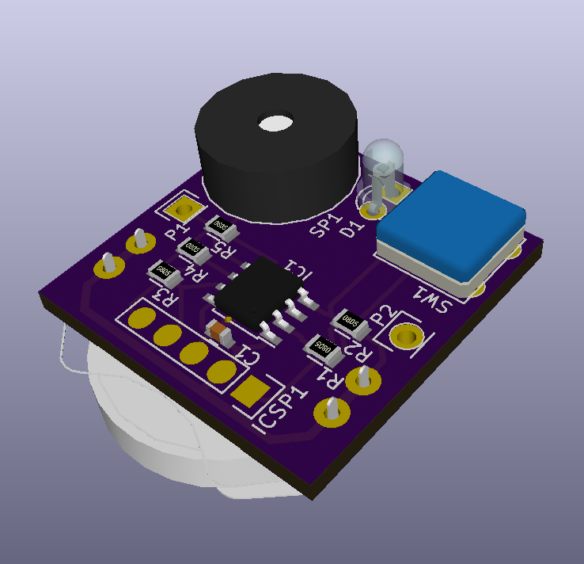

# Low Power Continuity Tester

These are the hardware and software design files for my square inch
contest entry, the low power continuity tester.

## Goals

The design goals for this project are the following:

* **Small size**: maximum of 1 square inch PCB area.

* **Low power**: Should run for a decent amount on time on a single
  CR2032 cell.

* **Fully featured**: Have at least:

  * *Low voltage continuity test mode*: Compliance voltage < 0.5v, low
    current.

  * *Inverse continuity mode*: Beep if continuity is broken.

  * *Both modes with "latching" glitch capture*: start beeping
    immediately and keep beeping for at least a split second.

  * *Diode test mode*: Short beep on forward voltage within diode drop
    (0.1-0.7v), continuous beep on short circuit.

* **Simple to use**: no power switch, turn on by touching probes, mode
  switch with a single button.

* **Low cost!**

## Implementation

To achieve all those goals I decided to base my implementation around
a microcontroller, namely the PIC12LF1571, which is a stunningly cheap
and feature packed device. Digikey has it for
[50 cents a piece][PIC12LF1571-I/SN-ND] at quantity 10! that's barely
17 cents more than what you'd pay for a humble [555][LM555CMFS-ND]!
For your 50 cents you get quite a spread of peripherals: a fixed
voltage reference, a 10 bit adc, a 5 bit DAC(!), 3 16-bit PWMs (!!),
the standard 3 timers on top of that, analog comparator, 3.5k of flash
and 256 bytes of SRAM. Truly remarkable.

Another remarkable thing about this chip which makes it suitable to
achieve my goals is that it can be made to operate under very low
voltages (down to 1.8v) and using very little power. As low as a few
hundred nanowatts (that's less than a millionth of a watt) while
sleeping, allowing standby times measured in years.

### Electronics

The analog part of the circuit is extremely simplistic, just 3
resistors. The design is inspired on [elm-chan's][elms-tester] tester,
but with an aditional IO pin on the negative side of the resistor
divider. This extra pin provides aditional control for the diode test
feature and allows the tester to be turned on by touching probes.

The simplicity of the circuit is also it's Achiles Heel, it doesn't
provide any input protection at all, relying instead on the built in
protection diodes of the microcontroller. The reason why I didn't
include any input protection is because I couldn't find any protection
scheme that would afford enough protection without compromising power
consumption or precision. For example, using a simple 3.3v zener diode
on the input would leak an appreciable amount of current at 3V, so
much in fact that the diode itself would consume more power than the
pic does while asleep! *This circuit should never be used on circuits
under power, and certainly NOT anywhere near any mains/line power
cables!!!*

### Firmware

The firmware is written in C, using Microchip's MPLAB X and XC8
compiler in free mode. The code is configured as a simple state
machine:

The CPU runs at the slowest internal oscillator speed (31kHz) to save
power. On reset it jumps straight into sleep mode, where it lays
dormant until a button press is detected or the leads are touched
together. That is achieved by setting up an interrupt on pin change
right before going to sleep, the interrupt hardware still works
without a clock, which allows the processor to still be useful while
only using less than a microwatt of power.

Once it's woken up, the microcontroller enters a loop where it
continuously samples the ADC, detecting wether the resistance in
between the probes is low enough to signal continuity or not. The ADC
module and voltage references are turned on and off as necessary to
use as little power as possible. While in this mode I've measured an
average current consumption of around 150 to 200 microamps, which
would allow the tester to have over 800 hours of battery life.

Each idle state blinks the led to signal which mode the tester is in,
for continuity it's a single blink followed by a long pause, for
inverse continuity it's 2, and for diodes it's 3 fast blinks followed
by a long pause. The user can switch modes by pressing the button.

When the condition of continuity (or discontinuity) is detected, the
beeper is turned on, using one of the PWM channels to output a square
wave into the piezo buzzer. Once there is no more continuity (or
discontinuity), a count is started so that any "glitch" is stretched
to at least a split second, making it easier to hear sporadic
contacts.

The diode tester is slightly different, the beeper is started as soon
as the voltage in the tips is below 0.7V (a typical silicon diode
drop), and will stop a split second later if that voltage stays above
0.1V (just below what would drop on a shottky diode). If it's any
longer, the beeper will stay on indefinitely. This mode makes it easy
to test diodes for opens and shorts since a normal diode would produce
a short beep, a shorted diode would produce a continuous beep, and an
open one wouldn't beep at all.

## Bill of materials

* Main chip: U1, [Microchip PIC12LF1571][PIC12LF1571-I/SN-ND] ($0.50 @ qty 10)
* Buzzer: SP1, [Murata PKM13EPYH4000-A0][490-4698-ND] ($0.49 @ qty 10)
* Battery Holder: BT1, [Linx BAT-HLD-001-THM][BAT-HLD-001-THM-ND] ($0.28 @ qty 10)
* Button: SW1, [TE Connectivity 1825910-7][450-1804-ND] ($0.06 @ qty 10)
* Decoupling cap: C1, 100nF, 0603, ceramic. (~$0.02)
* Resistors: R1, R5, 4k7; R2, R3, R4, 22k; 0805 resistors (~$0.05)
* PCB: OSHPark 3 1x1 inch boards for $5 ($1.66 ea)
 
**Total bom cost for a prototype run**: $3.06 each! (more than half of it is the prototype PCB)

## License

Copyright 2015 Jose I. Romero.

The schematic, PCB and firmware are free software, released under the
GNU GPL as published by the Free Software Foundation, version 3. See
LICENSE.txt for more details.

[PIC12LF1571-I/SN-ND]: http://www.digikey.com/product-detail/en/PIC12LF1571-I%2FSN/PIC12LF1571-I%2FSN-ND/4739318
[LM555CMFS-ND]: http://www.digikey.com/product-detail/en/LM555CM/LM555CMFS-ND/1051271
[elms-tester]: http://elm-chan.org/works/cch/report_e.html
[490-4698-ND]: http://www.digikey.com/product-detail/en/PKM13EPYH4000-A0/490-4698-ND/1219329
[BAT-HLD-001-THM-ND]: http://www.digikey.com/product-detail/en/BAT-HLD-001-THM/BAT-HLD-001-THM-ND/3044009
